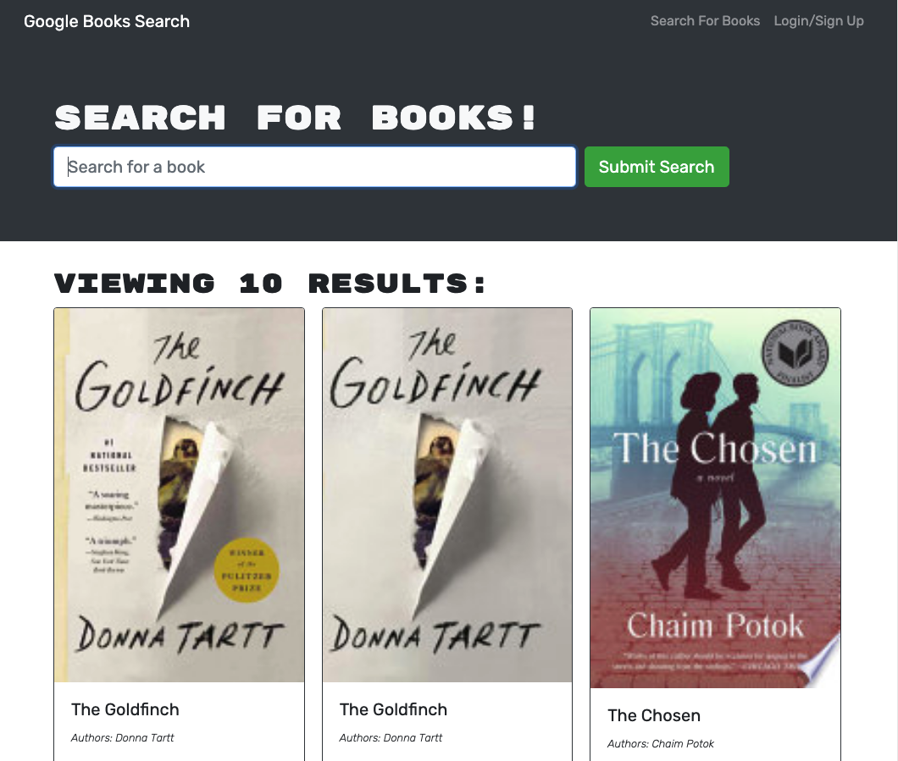

# Book Search Engine

## Description

Refactored MERN application built with a RESTful API to be a GraphQL API build with Apollo Server.

## Built With

- MERN Stack
- Mongoose
- Apollo Server
- GraphQL

## Live App

Visit the live app at 

## Screenshot

## Questions

For questions contact Sophia Barrett at sophia@yoursummit.media or visit github.com/sophiabarrett.

## License

Copyright © 2021 Sophia Barrett
